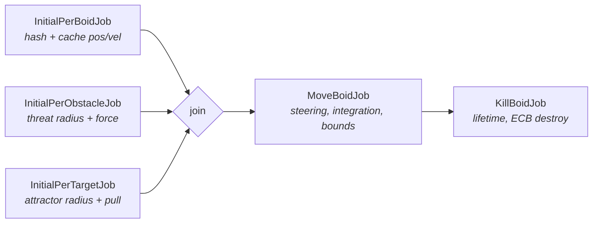
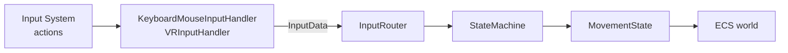

# Boid Simulation — Unity DOTS / ECS

A job-scheduled, Burst-compiled flocking simulation built on Unity's Entities package,
designed to keep large agent counts interactive. Desktop and VR run from one input
pipeline and one build.

**Scope:** this repository contains simulation and input source only. Scenes, prefabs,
materials and art are not included, so there is nothing to press Play on — read it as a
code sample rather than a runnable project.

---

## Architecture

### Simulation frame

Three gather jobs run in parallel, flattening entity data into contiguous arrays and
building the spatial hash. They join before steering, which reads all three.



The gather step exists so `MoveBoidJob` reads flat `NativeArray`s instead of chasing
entity chunks through random access — the neighbour loop is the hot path, and its memory
pattern matters more than its instruction count.

### Input



Handlers translate device-specific events into device-agnostic `InputData`. The router
fans typed input out to subscribers. The result is that a mouse click and a VR controller
trigger reach `MovementState` through one code path, distinguished only by `InputSource`
flags where the difference actually matters. `CameraManager` picks handler and camera rig
at runtime by detecting whether an XR display is live, so the same build serves both.

---

## Design decisions worth explaining

### Spatial hashing instead of O(n²)

Neighbour search uses a `NativeParallelMultiHashMap<uint, int>` keyed on quantised world
position. Each boid samples the 3×3×3 block of cells around it rather than the whole
population, and a `MaxNeighbor` cap bounds the inner loop so a dense school can't stall a
worker thread.

<!-- If you can defend the number, add it here. Format:
     "Measured ~N agents at M FPS on <CPU / GPU>."
     Leave it out rather than estimating — expect to be asked about it in interview. -->

### Density-modulated flocking weights

Uniform separation has a failure mode: a boid deep inside a large school is pushed toward
the centre by opposing neighbours and gets stuck. Local density is accumulated with
quadratic distance falloff, then reshapes the classic three weights:

```csharp
float densityFactor   = math.saturate(neighborData.localDensity / BoidSettings.OptimalNeighborCount);
float separationCurve = 1f - math.abs(densityFactor - DENSITY_PEAK);
float cohesionWeight  = BoidSettings.CohesionWeight * math.exp(-densityFactor * DENSITY_FALLOFF);
```

Separation rises to a peak and falls off past it; cohesion decays exponentially as density
climbs. Schools stay coherent without collapsing inward.

### Turn-rate limiting

Real fish can't reverse instantly. `BoidMath.CalculateTurn` clamps angular delta per update
by rotating the current heading around the axis perpendicular to current and desired
direction, then derives the acceleration that achieves that limited turn. Clamping the
acceleration vector directly is simpler and looks robotic.

### Predator response derived from observed behaviour

Obstacle avoidance blends with flocking rather than overriding it, which was the change
that made real schooling formations appear as emergent behaviour rather than scripted
states — the school splitting cleanly around a predator moving parallel to it and
reforming behind, stretching and dispersing when moving perpendicular, and balling
tightly under sustained threat. None of those are special-cased in code.

### Spawn ordering

Spawning at scale has an ordering hazard: one job writes a boid's position while another is
already moving it. Handled with a two-phase tag handoff — `SpawnBoidJob` adds
`SpawnedBoidTag`, and only once the transform has landed does `ResetBoidJob` swap it for
`BoidTag`, which is what the movement query filters on. Requests batch across frames
(`MAX_SPAWNS_PER_FRAME`) so a large spawn amortises instead of spiking.

---

## Start here

| File | Why |
|---|---|
| `MoveBoidJob.cs` | The simulation core — steering, neighbour gathering, force blending |
| `BoidSystem.cs` | Job scheduling, dependency chaining, allocator usage |
| `BoidMath.cs` | Turn limiting and boundary reflection |
| `InputRouter.cs` | The device-agnostic input abstraction |

## Layout

```
Assets/Scripts/
├── DOTS/
│   ├── Boid/       BoidSystem, MoveBoidJob, InitialBoidJob, BoidMath, components, authoring
│   ├── Spawn/      SpawnSystem, SpawnAuthoring, spawn components
│   ├── Obstacle/   Predator/threat components and authoring
│   └── Target/     Attractor components, authoring, destination system
├── Input/          Handlers, router, state machine, camera manager, input actions
└── UI/             Performance HUD, world-space follow UI
```

## Requirements

Unity 6, with Entities + Entities Graphics, Input System, XR Interaction Toolkit **3.x**
(the source imports `UnityEngine.XR.Interaction.Toolkit.Interactors`, a namespace that
does not exist in 2.x), XR Plugin Management, and URP. No XR provider plugin is needed to
compile — without one, `CameraManager` falls through to the desktop path automatically.

---

## Known limitations

Listed because they're real, not hypothetical:

- **Target arrays are mis-sized.** In `BoidSystem`, `targetRadius` and `targetAttraction`
  are allocated with `obstacleCount` rather than `targetCount`. With more targets than
  obstacles this writes out of bounds. `targetPositions` is sized correctly, which is what
  makes it easy to miss.
- **Spawn events leak an entity.** `SpawnSystem` removes the `SpawnEventBuffer` component
  but never destroys the entity holding it, so one empty entity accumulates per spawn request.
- **No simulation LOD.** Every agent updates at full rate every frame regardless of distance
  from the camera. Tiering update frequency by distance is the obvious next optimisation and
  the one with the most headroom.
- **Steering is single-resolution.** Neighbour sampling always walks 27 cells; boids in
  sparse regions pay the same cost as boids in dense ones.
- **Authoring defaults are placeholders.** Component definitions and bakers were
  reconstructed from their call sites, so field names and types are exact but the default
  inspector values are estimates and need retuning against the original behaviour.
